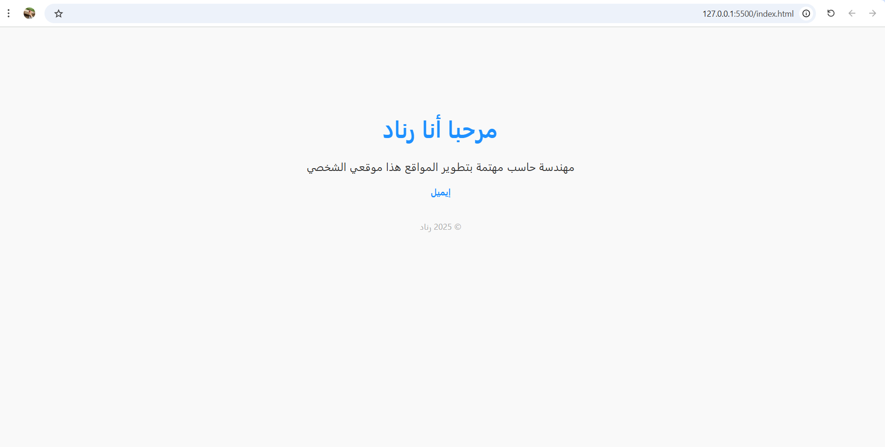

# personal-website

This is a very simple personal website built using only HTML and CSS.

## 🌟 Features

- My name and short introduction
- Email for contact
- Clean and minimal design
- Mobile-friendly

## 💻 Technologies Used

- HTML5
- CSS3

## 🚀 How to Use

Just open the index.html file in any web browser (like Chrome, Firefox, or Edge). No installation required.

## 📸 Screenshot

---

### Author

Created by [renad amin faydh] – 2025
